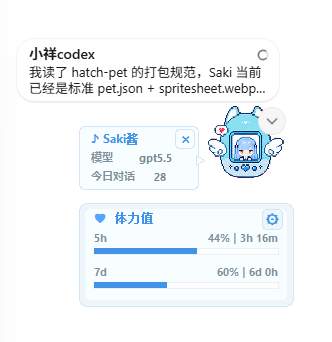
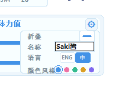

# Saki Codex Pet Overlay

Codex 桌宠扩展包：内置 Saki 宠物，并附带一个跟随宠物的体力值/模型/今日对话挂件。

## 效果展示

桌面工作展示：



设置页面：



## 功能

安装后会完成这些事情：

- 将 Saki 安装到 `%USERPROFILE%\.codex\pets\saki\`
- 将挂件安装到 `%USERPROFILE%\.codex\saki-codex-pet-overlay\`
- 将当前 Codex 宠物切换为 `Saki`
- 创建桌面快捷方式
- 创建开机自启动快捷方式
- 启动挂件
- 第一次启动时自动展开挂件设置面板，方便先完成 display name、语言和颜色设置

用户仍然可以在 Codex 的 `设置 -> 外观 -> 宠物` 中切换成 Dewey、Codex、Null Signal 或其它自定义宠物。挂件会继续跟随当前宠物，并同步显示当前宠物名。

## Requirements

- Windows
- Codex Desktop
- Node.js 18+
- Python 3，并且 `pythonw.exe` 或 `python.exe` 已加入 PATH

## Install

GitHub 一键安装：

```powershell
npx github:rookie-09/saki-codex-pet-overlay install
```

GitHub 仓库：

```text
https://github.com/rookie-09/saki-codex-pet-overlay
```

## Commands

安装并启动：

```powershell
npx github:rookie-09/saki-codex-pet-overlay install
```

启动挂件：

```powershell
npx github:rookie-09/saki-codex-pet-overlay start
```

停止挂件：

```powershell
npx github:rookie-09/saki-codex-pet-overlay stop
```

卸载快捷方式并停止挂件：

```powershell
npx github:rookie-09/saki-codex-pet-overlay uninstall
```

`uninstall` 会移除桌面快捷方式和开机自启动快捷方式。安装文件会保留在 `%USERPROFILE%\.codex\saki-codex-pet-overlay\`，方便重新启动或手动检查。

## Usage

安装完成后，挂件会自动启动并贴在 Codex 宠物下方。

设置齿轮里可以调整：

- 折叠挂件
- 自定义当前宠物的 display name
- 切换中文/英文
- 切换主题色

自定义 display name 会保存到：

```text
%USERPROFILE%\.codex\quota-overlay-settings.json
```

display name 按宠物 id 单独保存，所以不同宠物可以使用不同名字。

## Project Layout

```text
bin/saki-codex-pet.js        GitHub npx 安装器
overlay/quota_overlay.py     桌面挂件程序
pets/saki/pet.json           Saki 宠物配置
pets/saki/spritesheet.webp   Saki 宠物动画图集
```

## Notes

本项目不会修改或 patch Codex 应用文件。它只使用 Codex 标准宠物目录，并额外启动一个独立的 Windows 挂件进程。

安装器会写入一次 `%USERPROFILE%\.codex\.codex-global-state.json` 里的 `selected-avatar-id`，让 Saki 在安装后立即显示。之后可以随时在 Codex 设置中切换到其它宠物。
